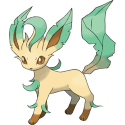

# Leafeon

A demonstration about streaming message with Apache Spark, Apache Kafka.

## Getting Started

These instructions will get you a copy of the project up and running on your local machine for development and testing purposes.

### Prerequisites

* [Docker](https://docs.docker.com/install/): Container technology

### Installing

* Start the env container

```
./startService.sh
```

* Build jar file

```
./gradlew build
```

* Execute jar file
```
java -jar build/libs/leafeon-0.0.1-SNAPSHOT.jar
```

## Running the tests

The test contains 2 primary steps:
* Step 1: Create the order to server. System send that message to kafka which will be consumed by spark. Spark process the message and send it to neo4j
```
curl -X POST \
  http://localhost:9999/order \
  -H 'Cache-Control: no-cache' \
  -H 'Content-Type: application/json' \
  -d '[
	{
		"productId": "F010001",
		"quantity": 5
	},
	{
		"productId": "F010002",
		"quantity": 5
	}
]'
```
```
curl -X POST \
  http://localhost:9999/order \
  -H 'Cache-Control: no-cache' \
  -H 'Content-Type: application/json' \
  -H 'Postman-Token: 10bc5488-081b-42d0-b63f-bdf881dec2a3' \
  -d '[
	{
		"productId": "F020001",
		"quantity": 5
	},
	{
		"productId": "F010002",
		"quantity": 1
	}
]'
```

* Step 2: Get all related product with provided productId (sorted by weight)
```
curl -X GET \
  'http://localhost:9999/relative?productId=F010001' \
  -H 'Cache-Control: no-cache' \
```
```
curl -X GET \
  'http://localhost:9999/relative?productId=F010002' \
  -H 'Cache-Control: no-cache' \
```

## Built With

* [Apache Kafka](https://kafka.apache.org/) - Distributed streaming platform.
* [Apache Kafka](https://spark.apache.org/) - Unified analytics engine for large-scale data processing.
* [MySQL](https://www.mysql.com/) - Relational database management system
* [Neo4j](https://neo4j.com/) - The graph database platform
* [Gradle](https://gradle.org/) - Dependency Management
